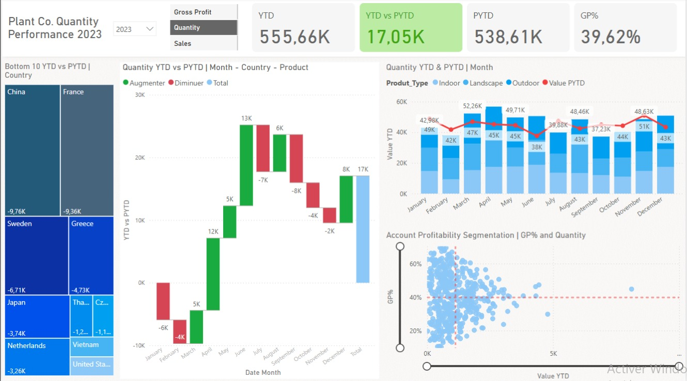

````markdown
# 📊 Projet Power BI – Analyse de la Performance Commerciale (Plant Co.)

## 🪴 Contexte

Ce projet Power BI simule une analyse complète des ventes et de la rentabilité d’une entreprise fictive : **Plant Co.**, spécialisée dans la distribution de plantes à travers le monde.

À partir de données brutes contenues dans un unique fichier Excel, le projet aboutit à la création d’un tableau de bord interactif professionnel, conçu pour aider à la prise de décisions stratégiques : suivi des performances, analyse par produit, segmentation des clients, et détection des points faibles.

---

## 🎯 Objectifs du projet

- Suivre l’évolution des ventes, de la quantité vendue et du profit brut dans le temps
- Comparer les performances année en cours (YTD) vs année précédente (PYTD)
- Identifier les pays les moins performants
- Visualiser la performance par type de produit ou catégorie
- Segmenter les clients selon leur rentabilité (GP%)
- Créer un outil visuel, dynamique, et interactif pour la direction commerciale

---

## 🧾 Données utilisées

Le fichier `plantco_data.xlsx` contient trois feuilles Excel :

| Feuille Excel       | Description                                                                 |
|---------------------|------------------------------------------------------------------------------|
| `PLANT_FACT`        | Table de faits des ventes : produit, date, client, quantité, prix, coûts    |
| `Accounts`          | Données clients : pays, coordonnées, identifiants                           |
| `PLANT_Hierarchy`   | Hiérarchie produit : famille, groupe, nom, taille, type                     |

Une table de dates (`dim_date`) est générée automatiquement dans Power BI pour gérer les mesures temporelles (année, mois, filtres dynamiques).

---

## 🧠 Étapes réalisées dans Power BI

### 1. Préparation des données (Power Query)
- Import des 3 feuilles depuis Excel
- Renommage des tables : `fact_sales`, `dim_account`, `dim_product`
- Nettoyage des colonnes, suppression des doublons
- Définition des types de données

### 2. Modélisation relationnelle
- Création du schéma en étoile :
  - `fact_sales` connecté à `dim_account`, `dim_product`, `dim_date`
- Vérification des cardinalités et création des relations 1 → plusieurs

### 3. Mesures DAX développées

#### Mesures de base :
- `Sales`, `Quantity`, `COGS`, `Gross Profit`, `GP%`

#### Mesures temporelles :
- `YTD Sales`, `PYTD Sales`
- `YTD Quantity`, `PYTD Quantity`
- `YTD Gross Profit`, `PYTD Gross Profit`
- `YTD vs PYTD`

#### Mesures dynamiques avec SWITCH :
Permet à l’utilisateur de choisir l’indicateur affiché via un slicer (`Sales`, `Quantity`, ou `Gross Profit`).

```dax
Switch_YTD = 
SWITCH(
   SELECTEDVALUE(Slicer_Values[Value]),
   "Sales", [YTD Sales],
   "Quantity", [YTD Quantity],
   "Gross Profit", [YTD Gross Profit]
)
````

---

## 📊 Présentation du dashboard



### Composants principaux :

| Élément                    | Rôle                                                              |
| -------------------------- | ----------------------------------------------------------------- |
| 🔢 KPI Cards               | Affiche YTD, PYTD, écart, GP%                                     |
| 🌍 Treemap                 | Top 10 des pays les moins performants                             |
| 📉 Waterfall Chart         | Variation mensuelle entre YTD et PYTD                             |
| 📊 Barres empilées + ligne | Analyse par type de produit, par mois                             |
| 🧮 Scatter Plot            | Segmentation des clients selon leur rentabilité (GP% vs quantité) |
| 🎛️ Slicers dynamiques     | Filtrage par année, type de valeur analysée                       |

---

## 📁 Arborescence du dépôt

```
powerbi-plantco-performance/
├─ dashboard_powerbi.pbix           → Fichier Power BI complet
├─ dashboard_powerbi.png            → Capture d’écran du rapport
├─ README.md                        → Présentation détaillée du projet
└─ data/
    └─ plantco_data.xlsx            → Données Excel (3 feuilles : ventes, clients, produits)
```

---

## 💡 Compétences démontrées

* Préparation et modélisation des données
* Création de mesures DAX avancées
* Maîtrise des visualisations Power BI
* Storytelling analytique pour l’aide à la décision
* Conception d’un rapport professionnel de bout en bout


