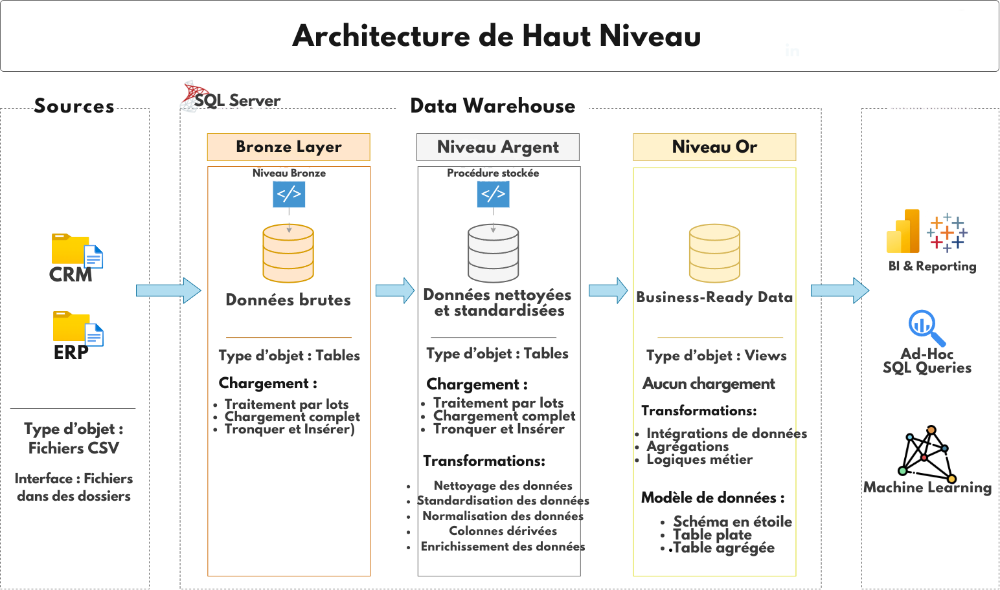

# Projet Data Warehouse

Bienvenue dans le dépôt du **Projet Data Warehouse** ! 🚀  
Ce projet démontre une solution complète d'entreposage de données et d'analytique, depuis la construction d'un entrepôt de données jusqu'à la génération d'insights exploitables. 
---
## 🏗️ Architecture des Données

L'architecture des données de ce projet suit l'Architecture Medallion avec les couches **Bronze**, **Silver** et **Gold** :


1. **Couche Bronze** : Stocke les données brutes telles quelles provenant des systèmes sources. Les données sont ingérées depuis des fichiers CSV dans la base de données SQL Server.
2. **Couche Silver** : Cette couche comprend des processus de nettoyage, de standardisation et de normalisation des données pour les préparer à l'analyse.
3. **Couche Gold** : Contient des données prêtes à l'emploi pour les entreprises, modélisées en schéma en étoile requis pour les rapports et l'analytique.

---
## 📖 Aperçu du Projet

Ce projet comprend :

1. **Architecture des Données** : Conception d'un entrepôt de données moderne utilisant l'Architecture Medallion avec les couches **Bronze**, **Silver** et **Gold**.
2. **Pipelines ETL** : Extraction, transformation et chargement des données depuis les systèmes sources vers l'entrepôt.
3. **Modélisation des Données** : Développement de tables de faits et de dimensions optimisées pour les requêtes analytiques.
4. **Analytique et Reporting** : Création de rapports et tableaux de bord basés sur SQL pour des insights exploitables.

🎯 Ce dépôt est une excellente ressource pour les professionnels et étudiants souhaitant démontrer leurs compétences en :
- Développement SQL
- Architecture de Données
- Ingénierie des Données  
- Développement de Pipelines ETL  
- Modélisation de Données  
- Analytique des Données  


## 🚀 Exigences du Projet

### Construction de l'Entrepôt de Données (Ingénierie des Données)

#### Objectif
Développer un entrepôt de données moderne utilisant SQL Server pour consolider les données de ventes, permettant des rapports analytiques et une prise de décision éclairée.

#### Spécifications
- **Sources de Données** : Importer des données de deux systèmes sources (ERP et CRM) fournies sous forme de fichiers CSV.
- **Qualité des Données** : Nettoyer et résoudre les problèmes de qualité des données avant l'analyse.
- **Intégration** : Combiner les deux sources en un modèle de données unique et convivial conçu pour les requêtes analytiques.
- **Portée** : Se concentrer uniquement sur le jeu de données le plus récent ; l'historisation des données n'est pas requise.
- **Documentation** : Fournir une documentation claire du modèle de données pour soutenir à la fois les parties prenantes de l'entreprise et les équipes d'analyse.

---

### BI : Analytique et Reporting (Analyse de Données)

#### Objectif
Développer des analyses basées sur SQL pour fournir des insights détaillés sur :
- **Comportement des Clients**
- **Performance des Produits**
- **Tendances des Ventes**

Ces insights permettent aux parties prenantes d'accéder aux métriques commerciales clés, facilitant la prise de décision stratégique.  

Pour plus de détails, consultez [docs/requirements.md](docs/requirements.md).

## 📂 Structure du Dépôt
```
data-warehouse-project/
│
├── datasets/                           # Jeux de données brutes utilisés pour le projet (données ERP et CRM)
│
├── docs/                               # Documentation du projet et détails d'architecture
│   ├── etl.drawio                      # Fichier Draw.io montrant différentes techniques et méthodes d'ETL
│   ├── data_architecture.drawio        # Fichier Draw.io montrant l'architecture du projet
│   ├── data_catalog.md                 # Catalogue des jeux de données, avec descriptions des champs et métadonnées
│   ├── data_flow.drawio                # Fichier Draw.io pour le diagramme de flux de données
│   ├── data_models.drawio              # Fichier Draw.io pour les modèles de données (schéma en étoile)
│   ├── naming-conventions.md           # Guidelines cohérentes de nommage pour les tables, colonnes et fichiers
│
├── scripts/                            # Scripts SQL pour ETL et transformations
│   ├── bronze/                         # Scripts pour l'extraction et le chargement des données brutes
│   ├── silver/                         # Scripts pour le nettoyage et la transformation des données
│   ├── gold/                           # Scripts pour la création de modèles analytiques
│
├── tests/                              # Scripts de test et fichiers de qualité
│
├── README.md                           # Aperçu du projet et instructions
├── LICENSE                             # Informations de licence pour le dépôt
├── .gitignore                          # Fichiers et répertoires à ignorer par Git
└── requirements.txt                    # Dépendances et exigences pour le projet


